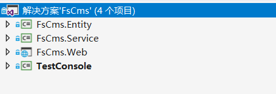
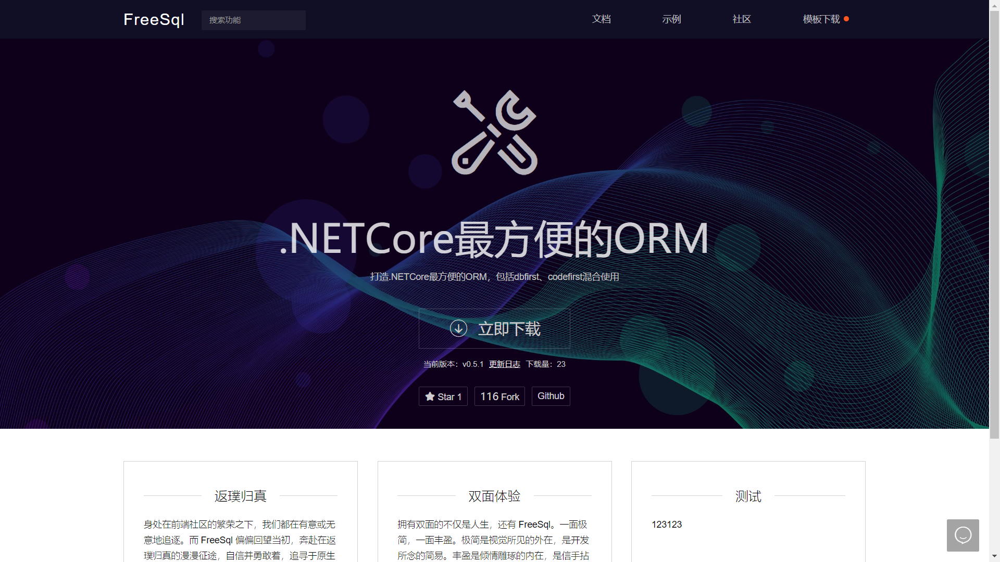
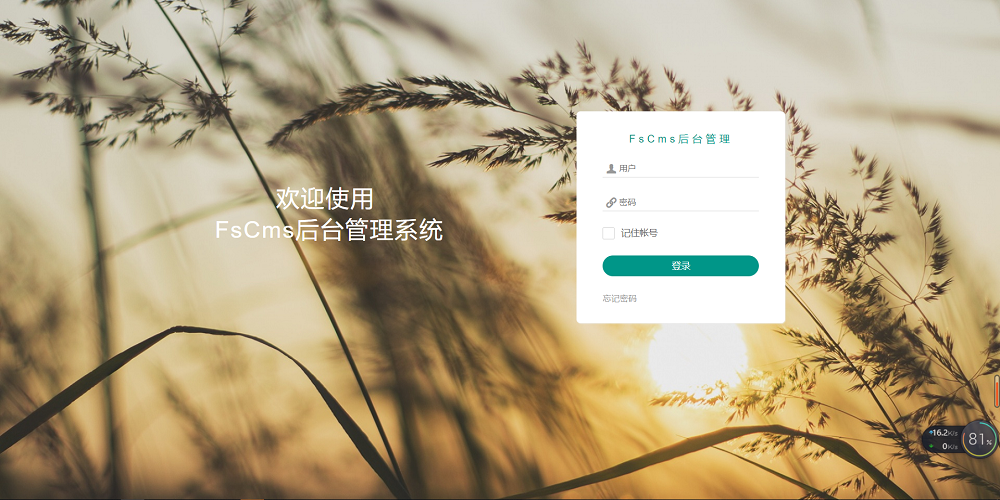
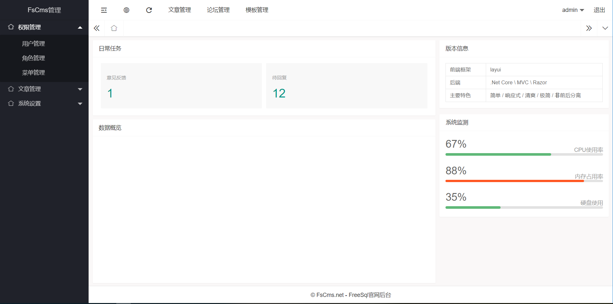
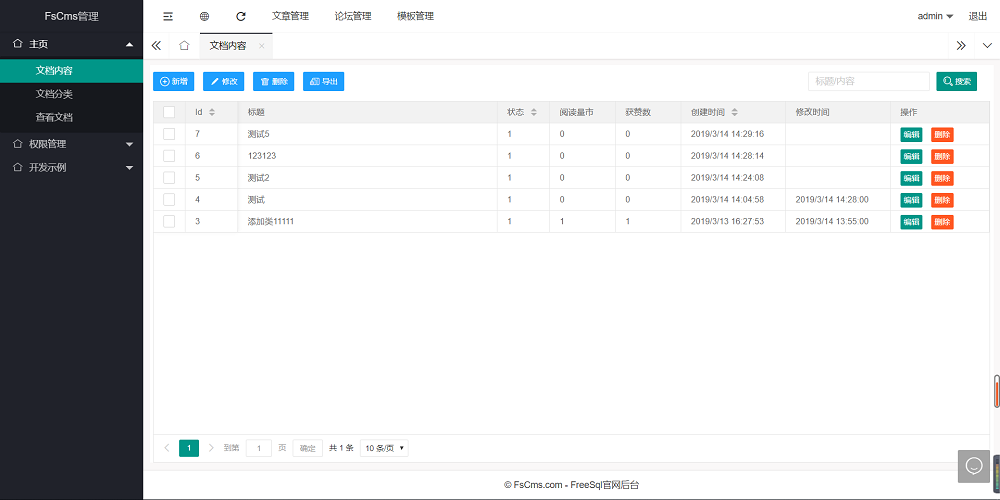
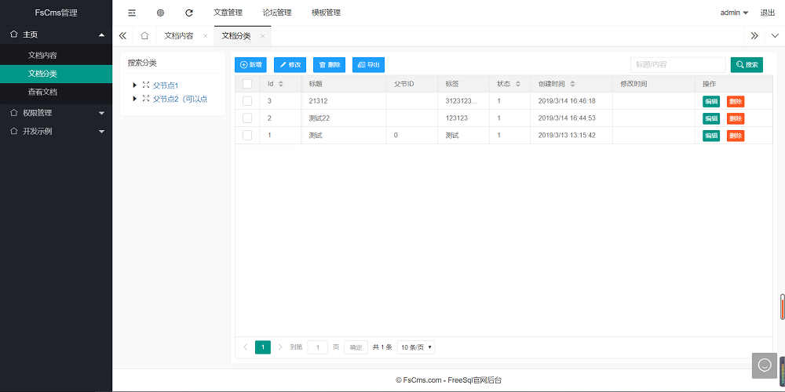

#### 介绍
内容管理系统

#### 软件架构

1. Asp.net core mvc 
2. [FreeSql](https://github.com/2881099/FreeSql)
3. [Layui](https://www.layui.com/)

#### 项目进度

- [x] 接入FreeSql，封装数据库操作；
- [x] 使用FreeSql，自由切换多种数据库，MySql/SqlServer/PostgreSQL/Oracle/Sqlite；
- [x] 后台管理功能开发结果设计；
- [x] 使用layui搭建后台开发框架，封装通用处理JS；
- [x] AutoFac接入；
- [x] 开发权限管理模块；
- [x] 开发文章管理；
- [x] 开发文章分类；
- [ ] 开发模板管理模块；
- [ ] 开发论坛管理模块；
- [x] 设计与开发前端站点；

#### 项目结果

#### 项目截图

1. Fork 本仓库
2. 新建 Feat_xxx 分支
3. 提交代码
4. 新建 Pull Request